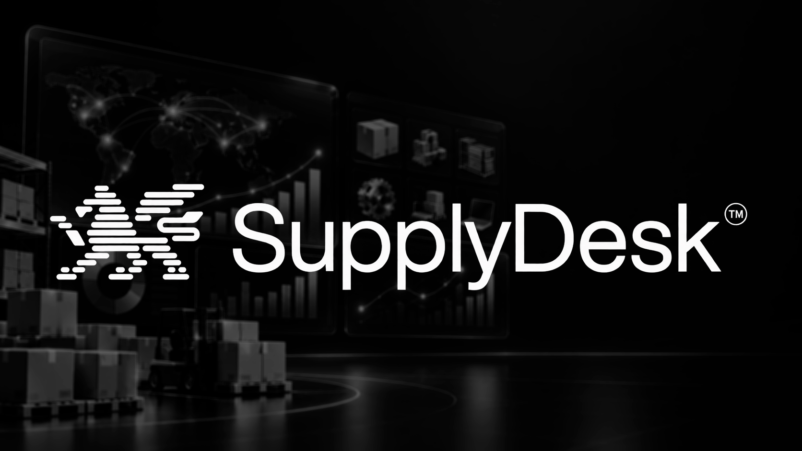
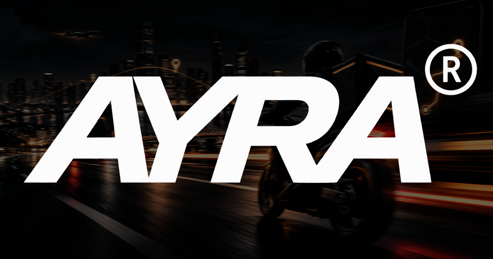
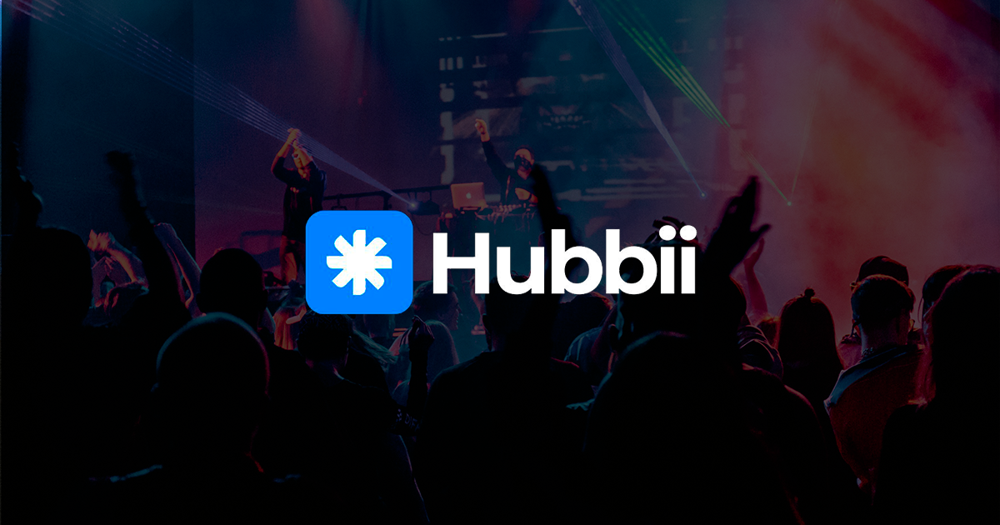

<div align="center">

# Rodrigo Camilo — Portfólio

### Full Stack Developer

Portfólio profissional onde apresento minha experiência, projetos e tecnologias utilizadas no desenvolvimento de aplicações web e mobile.

[](https://rodrigocamilo.vercel.app/)
[](https://www.linkedin.com/in/rodrigocpaixao)
[](https://github.com/Rodrigo-Camilo)

</div>

---

## Sobre o projeto

Este portfólio foi desenvolvido para apresentar minha trajetória como **Desenvolvedor Full Stack**, reunindo experiência profissional, formação, competências técnicas e alguns dos principais projetos que desenvolvi.

A aplicação foi construída com foco em:

- experiência responsiva para desktop e mobile;
- apresentação visual dos projetos;
- performance e acessibilidade;
- animações leves;
- organização e reutilização de componentes;
- SEO e compartilhamento;
- demonstrações em vídeo com streaming adaptativo.

---

## Projetos em destaque

### SupplyDesk



Dashboard administrativo B2B desenvolvido para centralizar a gestão de **fornecedores, produtos, preços, pedidos e comissões**.

**Principais funcionalidades:**

- comparação de ofertas entre fornecedores;
- histórico e gráficos de variação de preços;
- gerenciamento de produtos e fornecedores;
- snapshots de preços e comissões;
- importação de arquivos XLSX com validação e prévia;
- indicadores operacionais e financeiros;
- autenticação e suporte a múltiplos administradores.

---

### AYRA



Plataforma de entregas urbanas desenvolvida para simplificar todo o processo de solicitação de uma entrega, desde a cotação até o acompanhamento do pedido.

**Principais funcionalidades:**

- cotação de entrega baseada na rota;
- seleção do tipo de veículo;
- integração com Google Maps;
- cálculo de rota no servidor;
- pagamentos através do Mercado Pago;
- webhooks e reconciliação de pagamentos;
- painel para motoristas;
- painel administrativo;
- acompanhamento do pedido através de código público;
- experiência mobile-first.

[](https://www.ayraproject.com/)

---

### Hubbii



Plataforma voltada à descoberta e gestão de estabelecimentos locais, oferecendo ferramentas tanto para consumidores quanto para parceiros.

**Principais funcionalidades:**

- descoberta de estabelecimentos por categorias e regiões;
- páginas completas dos estabelecimentos;
- cardápio digital;
- sistema de pedidos e delivery;
- agenda digital;
- eventos;
- fila virtual;
- dashboard para parceiros;
- dashboard administrativo;
- campanhas e indicadores da plataforma;
- experiência responsiva para desktop e mobile.

---

## Tecnologias

<div align="center">


</div>

<br>

Principais tecnologias utilizadas neste portfólio:

- **Next.js 16**
- **React 19**
- **JavaScript**
- **CSS Modules**
- **Canvas API**
- **Mux Player**
- **ESLint**

As tecnologias específicas utilizadas em cada produto são apresentadas individualmente dentro do portfólio.

---

## Destaques técnicos

O projeto utiliza recursos para melhorar experiência, acessibilidade e performance:

- App Router do Next.js;
- Server Components por padrão;
- Client Components somente onde existe interação;
- layout totalmente responsivo;
- navegação por teclado;
- suporte a `prefers-reduced-motion`;
- hero interativo utilizando Canvas;
- animação de código com efeito de digitação;
- conteúdo centralizado em uma camada de dados;
- metadados para SEO e compartilhamento;
- vídeos entregues pelo Mux com streaming adaptativo HLS;
- suporte a telas a partir de 320px;
- tratamento de safe areas em dispositivos móveis.

---

## Estrutura

```text
portfolio/
├── public/
│   ├── perfil.png
│   └── projects/
│       ├── supplydesk/
│       ├── ayra/
│       └── hubbii/
│
├── src/
│   ├── app/
│   │   ├── globals.css
│   │   ├── layout.js
│   │   └── page.js
│   │
│   ├── components/
│   │   ├── portfolio/
│   │   └── ui/
│   │
│   └── data/
│       └── portfolio.js
│
├── .gitattributes
├── .gitignore
└── package.json
```

---

## Executando localmente

### Pré-requisitos

- Node.js 20.9+
- npm
- Git

Clone o repositório:

```bash
git clone https://github.com/Rodrigo-Camilo/portfolio.git
```

Entre na pasta e instale as dependências:

```bash
cd portfolio
npm install
```

Execute o projeto:

```bash
npm run dev
```

A aplicação ficará disponível em [http://localhost:3000](http://localhost:3000).

---

## Scripts

| Comando | Descrição |
|---|---|
| `npm run dev` | Inicia o ambiente de desenvolvimento |
| `npm run build` | Gera o build de produção |
| `npm run start` | Executa o build de produção |
| `npm run lint` | Executa a análise do ESLint |

---

## Streaming de vídeo

As demonstrações dos projetos são entregues pelo **Mux Player** em streaming adaptativo. O navegador recebe automaticamente a resolução mais adequada para o dispositivo e para a conexão, sem incluir arquivos de vídeo pesados no repositório ou no deploy da aplicação.

---

## Contato

<div align="center">

Desenvolvido por **Rodrigo Camilo Paixão**

<br>

[](https://www.linkedin.com/in/rodrigocpaixao)
[](https://github.com/Rodrigo-Camilo)
[](mailto:rodrigocamilo2006@gmail.com)

</div>
